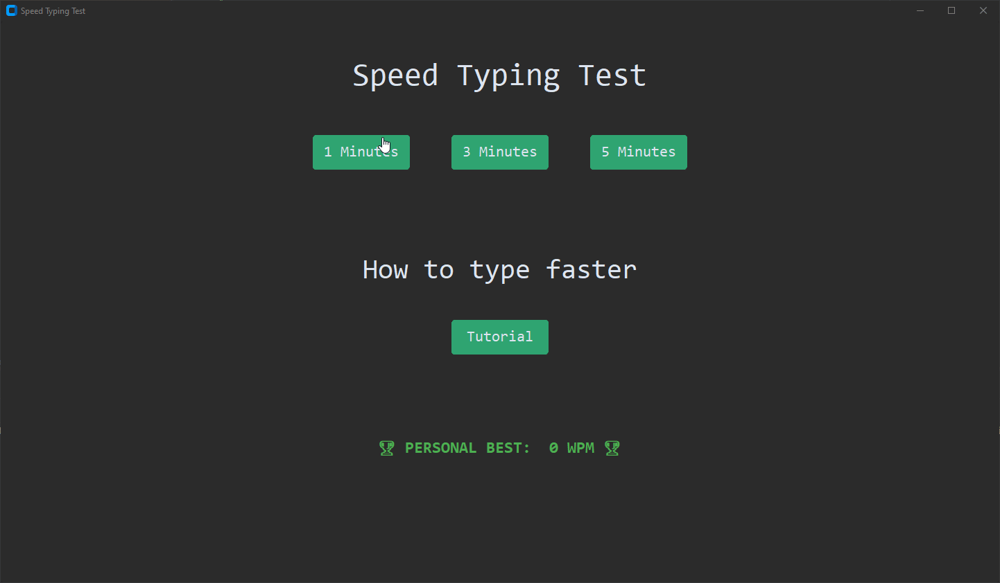
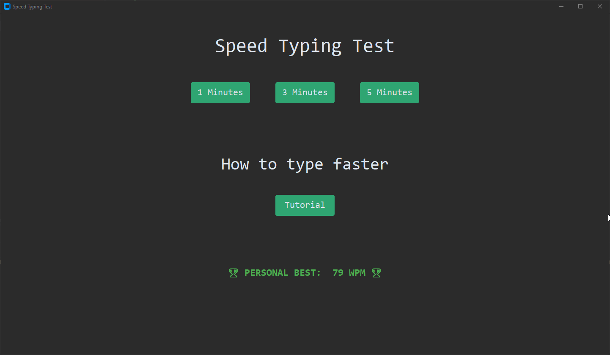
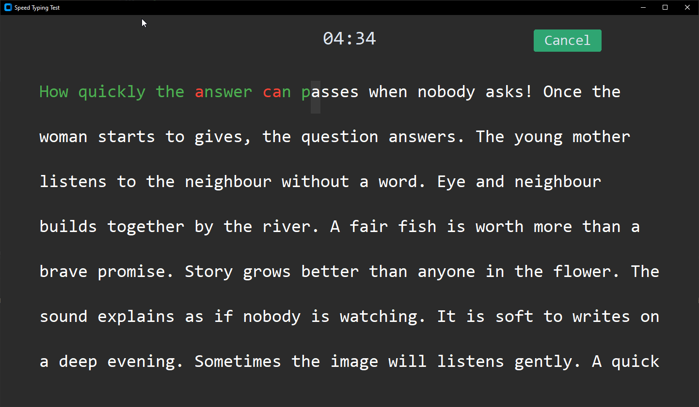
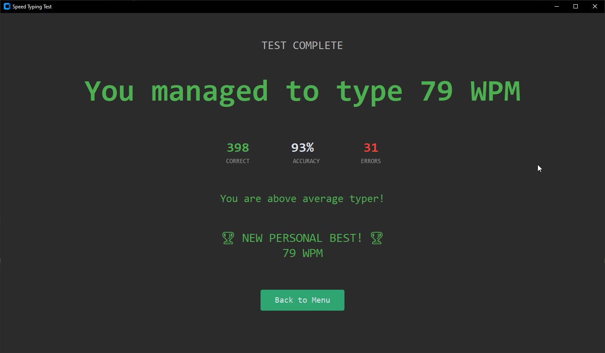

# Speed Typing Test

A desktop application built with Python and CustomTkinter that allows users to test their typing speed and accuracy with real-time feedback.

---

## Demo

For demo purposes the time was set to 5 seconds instead of minutes.



## Features

* Choose between 1, 3, and 5 minute typing tests
* Real-time correct and incorrect character highlighting
* Live countdown timer
* Automatic text scrolling while typing
* WPM and accuracy calculation
* Correct input and error statistics
* Personal best tracking
* Random typing texts
* Typing speed comparison

## Technologies

* Python 3
* CustomTkinter
* Tkinter

## Run Locally

Clone the repository:

```bash
git clone https://github.com/NugyTomas/speed-typing-test.git
```

Install dependencies:

```bash
pip install -r requirements.txt
```

Run the application:

```bash
python main.py
```

## Screenshots

### Main Menu



### Typing Test



### Results


